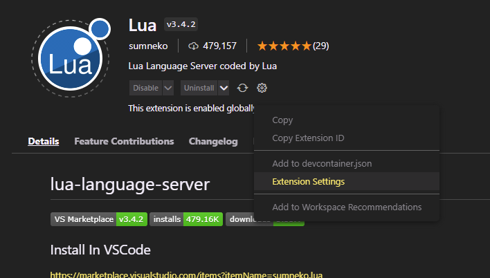
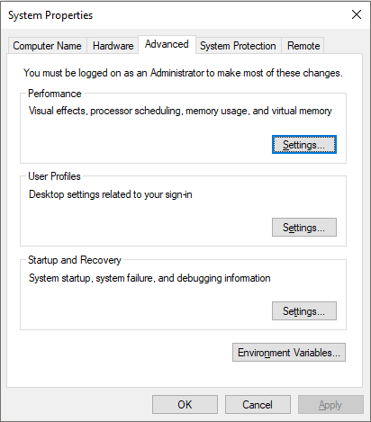
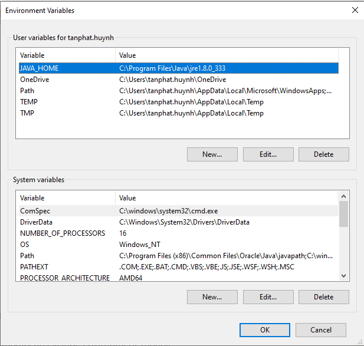
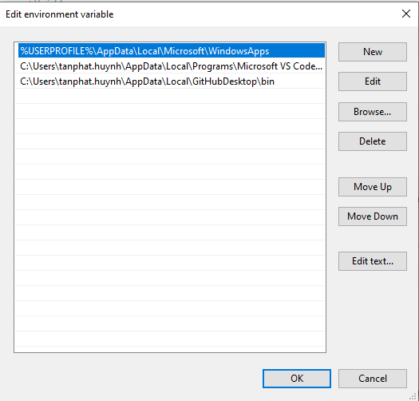

- [Config LUA development environment](#config-lua-development-environment)
  - [IntelliJ IDEA(Community Edition)](#intellij-ideacommunity-edition)
    - [Download & Install](#download--install)
    - [Config lua environment](#config-lua-environment)
    - [Config lua external library](#config-lua-external-library)
  - [Visual Code](#visual-code)
    - [Download & Install](#download--install-1)
    - [Config lua environment](#config-lua-environment-1)
    - [Config lua external library](#config-lua-external-library-1)
- [Link 2](#link-2)
- [Link 3](#link-3)
- [Link 4](#link-4)
- [Link 5](#link-5)

# Config LUA development environment

## IntelliJ IDEA(Community Edition)

* Reference: https://github.com/EmmyLua/IntelliJ-EmmyLua

### Download & Install

* Download IntelliJ IDEA(Community Edition) here: https://www.jetbrains.com/idea/download/#section=windows
* Install IntelliJ IDEA(Community Edition).

### Config lua environment

* Open `File -> settings` panel.
* Select `Plugins`.
* Search `EmmyLua` and click `Install`.
* Restart IDEA after installation complete.
* Reference: https://emmylua.github.io/installation.html
  
### Config lua external library

* Open project folder.
* Open `File -> Project Structure` panel.
* Select `Libraries`.
* Click button `Add`, select `Lua Zip Library`.
* Select folder lua you want to add, for example: `C:\Program Files (x86)\sandboxol\BlockmanEditor\lua`

## Visual Code

* Reference: https://github.com/EmmyLua/VSCode-EmmyLua

### Download & Install

* Download Visual Code: https://code.visualstudio.com/download
* Install Visual Code.

### Config lua environment

* Select `Extensions`.
* Search `EmmyLua` and click `Install`.
* Restart Visual Code after installation complete.

<u><b>Note:</b></u> 

* The Java Runtime Environment (JRE) version 8 or newer is required for EmmyLua extension. You can download the JRE v8 [here](https://www.java.com/en/download/)

* The JRE needs to be added into the `Environment variable` as the name `JAVA_HOME`. If you don't know how to add an `Environment variable`, you can follow the instruction [here](#link-3)

### Config lua external library

* Select `Extensions`.
* Search `Lua` and click `Install` on the extension come from `sumneko`.
* Click the `Gear` icon then select the `Extension Settings`.

* Find the `Library` property, then click `Add Item`. Copy the path to your libraries.
* Click `OK` to take the effect.

# Link 2

Lorem ipsum dolor sit amet, consectetur adipiscing elit. Praesent sit amet sollicitudin neque. Duis id mi ligula. In viverra velit vitae tortor congue dapibus. Integer vestibulum, turpis sed tempor viverra, ligula nibh commodo leo, nec lacinia nibh erat a sapien. Nullam nec sodales est. Class aptent taciti sociosqu ad litora torquent per conubia nostra, per inceptos himenaeos. Quisque varius eu dolor nec consectetur. Vestibulum sagittis ultricies erat, sed tincidunt magna dapibus at.

Ut elementum, dui sed scelerisque consectetur, mi nisi elementum diam, non rhoncus lacus lectus ut lacus. Aenean eget mauris risus. Integer placerat, augue at fringilla dignissim, massa sapien mollis arcu, quis faucibus nulla risus et quam. Vestibulum a lacus in mauris ultricies mattis. Suspendisse malesuada venenatis tristique. Nulla facilisi. Praesent a tempus ipsum. Nulla facilisi.

# Configs the PC's Environment variables

1. On the Windows taskbar, right-click the **Windows** icon and select **System**.
2. In the **Settings** window, under **Related Settings**, click **Advanced system settings**

3. On the **Advanced** tab, click **Environment Variables**.

4. Click **New** to create a new environment variable. Click **Edit** to modify an existing environment variable. 
4.1. To adding value to **Path variable**, Double click to **Path variable**, then click **New** to create new path value or click **Edit** to modify an existing path. 

5. After creating or modifying the environment variable, click **Apply** and then **OK** to have the change take effect.

<u><b>Note:</b></u> If the change does not take effect, please close all the **File Explorer**.

# Link 4

Lorem ipsum dolor sit amet, consectetur adipiscing elit. Praesent sit amet sollicitudin neque. Duis id mi ligula. In viverra velit vitae tortor congue dapibus. Integer vestibulum, turpis sed tempor viverra, ligula nibh commodo leo, nec lacinia nibh erat a sapien. Nullam nec sodales est. Class aptent taciti sociosqu ad litora torquent per conubia nostra, per inceptos himenaeos. Quisque varius eu dolor nec consectetur. Vestibulum sagittis ultricies erat, sed tincidunt magna dapibus at.

Ut elementum, dui sed scelerisque consectetur, mi nisi elementum diam, non rhoncus lacus lectus ut lacus. Aenean eget mauris risus. Integer placerat, augue at fringilla dignissim, massa sapien mollis arcu, quis faucibus nulla risus et quam. Vestibulum a lacus in mauris ultricies mattis. Suspendisse malesuada venenatis tristique. Nulla facilisi. Praesent a tempus ipsum. Nulla facilisi.

# Link 5

Lorem ipsum dolor sit amet, consectetur adipiscing elit. Praesent sit amet sollicitudin neque. Duis id mi ligula. In viverra velit vitae tortor congue dapibus. Integer vestibulum, turpis sed tempor viverra, ligula nibh commodo leo, nec lacinia nibh erat a sapien. Nullam nec sodales est. Class aptent taciti sociosqu ad litora torquent per conubia nostra, per inceptos himenaeos. Quisque varius eu dolor nec consectetur. Vestibulum sagittis ultricies erat, sed tincidunt magna dapibus at.

Ut elementum, dui sed scelerisque consectetur, mi nisi elementum diam, non rhoncus lacus lectus ut lacus. Aenean eget mauris risus. Integer placerat, augue at fringilla dignissim, massa sapien mollis arcu, quis faucibus nulla risus et quam. Vestibulum a lacus in mauris ultricies mattis. Suspendisse malesuada venenatis tristique. Nulla facilisi. Praesent a tempus ipsum. Nulla facilisi.
