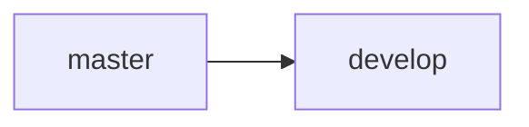
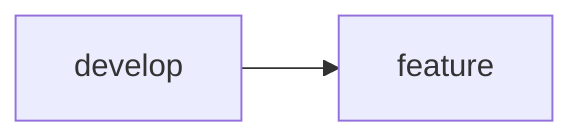
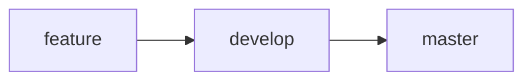
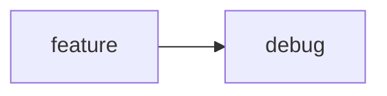

- [Branch rule](#branch-rule)
  - [Branch flow](#branch-flow)
  - [Branch merge rule](#branch-merge-rule)
  - [Branching Naming Convention](#branching-naming-convention)
- [Development flow](#development-flow)

# Branch rule

## Branch flow


* `master`: Branch is for release, never push code to this branch. It should be stable all the time and won’t allow any direct check-in. You can only merge it after code review.
* `develop`: Middle branch used to implement the feature, created from branch `master`, all feature branches will merge into this. The `develop` branch’s idea is to make changes in it and restrict the developers from making any changes in the master branch directly `develop` branch, then this `develop` branch will merge into `master` branch
* `feature`: Use for feature implement. Created from `develop` branch
* `debug`: Use for debug

## Branch merge rule

* When starting project: Create branch `develop` from branch `mater`

* When implement feature: Create branch `feature` from branch `develop`

* When release: Merge `feature` into `develop`, then merge `develop` into `master`

* When debug: Merge `feature` into `debug`.


* **Note: When releasing game or play test, need to create branch/tag to store**

## Branching Naming Convention

* All branch names must be in `lowercase`
* Names are separated by `_` and `/`. Eg:
```
fixbug/20220711_button_cant_click
ranking/ranking_implement
inventory/hero_inventory
```
* For release & test play branches, date information in `YYYYMMDD` format is required. Eg:
```
release/20220711_version1
release/20220711_fixbug
test_play/20220711_week1
```

# Development flow

```mermaid
graph TD;
    Create branch `develop`->`feature` --> Implement feature;   
    Implement feature --> Merge into `debug` for debugging;    
    Merge into `debug` for debugging --> Merge into `develop` for review;    
    Merge into `develop` for review --> Merge into `master` for release;    
    Merge into `master` for release; --> Create branch/tag for stored;    
```
