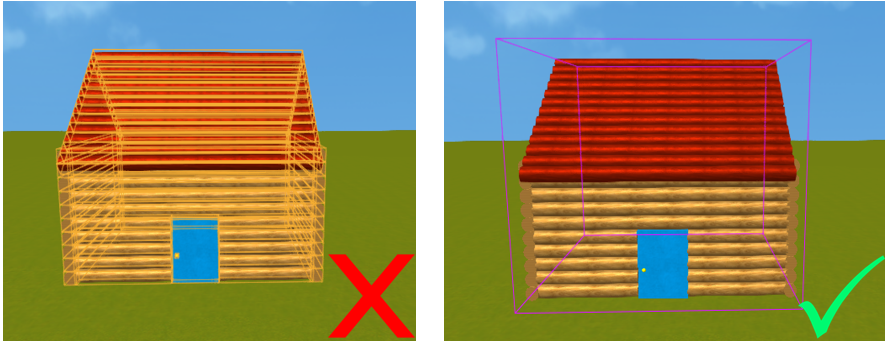
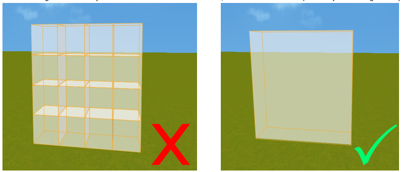

- [Building and Designing a Scene](#building-and-designing-a-scene)
  - [Map Split](#map-split)
  - [Model](#model)
  - [Mesh](#mesh)
  - [Parts and Surfaces](#parts-and-surfaces)
- [Object Properties Setting](#object-properties-setting)
  - [Semi-transparent](#semi-transparent)
  - [Anchor (OB5)](#anchor-ob5)
  - [Level of Detail (OB5)](#level-of-detail-ob5)

# Building and Designing a Scene											
																
## Map Split															
																
* The performance of the game can be affected if the map is too large. You can split up the different regions and dungeons of the map into multiple smaller maps. This will reduce the number of objects needing to be loaded on the screen simultaneously.													
* Developers can use teleport mechanics to allow players to teleport between different maps. For example, the inside and outside of a house can be done on two different maps, and make the house's door as the portal to connect these two maps.															
																
## Model															
																
* When you need to operate multiple objects at the same time, grouping them into one model can lead to better performance. For example, grouping all parts of the house into one model, and then using this one model to move, rotate, copy, etc.															
* Try not to group objects that are too far away into the same model; it is better to choose objects that are close and correlated to each other for grouping.															
* If you want the parts to have physical effects but also remain as a whole, you can combine them into a union.															

																
## Mesh															
																
* If you need to make a complex structure of terrain or decorations, please use the mesh model meshpart; it is better than the parts in both system performance and screen performance.															
* Please don't use oversized meshes; this will increase the pressure on the rendering performance; if this cannot be avoided, please try to split the oversized models into multiple components.															
																
## Parts and Surfaces															
																
* In order to ease the performance of the game on low-end phones, it is recommended the total number of parts in the scene does not exceed 10,000.															
* If the game has a large number of complex meshes, please try to keep the number of triangle in line of sight to 150,000 in order to run the game smoothly on low-end phones.															
* The number of parts and surfaces in the scene can be viewed in the upper left corner of the Scene editor.															
																
# Object Properties Setting																
																
## Semi-transparent															
																
* Semi-transparent objects can greatly limit the rendering performance optimization, so please use them sparingly.															
* If you need to use more than one semi-transparent object, please try to use a mesh and combine them. Try to avoid overlapping multiple semi-transparent objects.															
* Avoid allowing translucent objects to move and anchor them instead, as moveable semi-transparent objects can significantly degrade game performance.
  							

												
## Anchor (OB5)															
																
* Anchored objects are less taxing in terms of rendering and physics, so please anchor all objects that do not move.															
* If some objects that do not move will be controlled by the scripts and change states, such as being destroyed by an attack, etc., then these objects should not be checked for anchoring.															
																
## Level of Detail (OB5)															
																
* If there are a lot of detailed meshes on the map, please check the "Auto LOD" property of the meshes to improve the game performance in long-distance scenes.					

| Distance from the camera| Rendering details| 
| ------------- | ------------- |
| Within 250 blocks| High| 
| Between 250 and 500 blocks| Medium| 
| Beyond 500 blocks| Low| 

